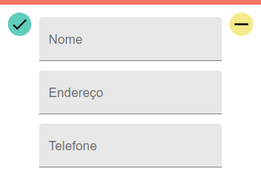
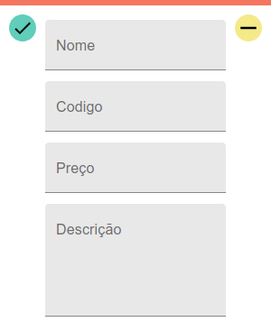
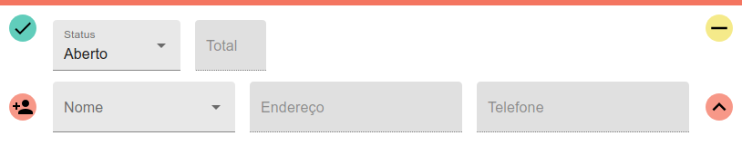

# Courier
## Requisitos
* Node.js
* npm
* Postgress
## Instalação
### Configurando o Banco de Dados
#### 1 - Criar Usuário
sudo -u postgres createuser --interactive
sudo -u postgres psql
ALTER USER aless WITH PASSWORD '123';
#### 2 - Criar Database
sudo -u postgres createdb transportadora
#### 3 - Executar script em Migrations
### Configurando o Servidor
#### 1 - Preencher credenciais do Banco de Dados
#### 2 - Executar
## Views
### Ações Padronizadas
#### Salvar Registro Criado

#### Atualizar

#### Deletar

### Clientes
#### Criar

##### Template Gerado


Nome e Endereço são obrigatórios.
### Produtos
#### Criar

##### Template Gerado

### Pedidos
#### Botão de Criar

#### Template Gerado


O cliente pode ser escolhido de uma lista ou criado com o pedido. Para isso, é necessário clicar no botão ao lado permitindo a edição completa dos campos.

A lista de produtos pode ser carregada, ou exibida quando em modo de criação, ao clicar no botão de expandir.

O total mostrado é igual ao valor informado pela API, quando não se carregou a lista de produtos, caso contrário o total fica de acordo com a lista de produtos.

Caso a lista de produtos não tenha sido carregada, atualizações não serão realizadas nela.

## CRUD API
### Cliente
#### Formato na Base de Dados
|id|nome|endereco|telefone|
|---|---|---|---|
#### Create
Os atributos _nome_ e _endereco_ são obrigatórios e não podem conter strings vazias, _telefone_ é opcional.
##### Body
```json
{  
    "nome": "some name",
    "endereco": "some address",
    "telefone": "something"
}
```
##### Resposta
```json
{  
    "id": 1,
    "nome": "some name",
    "endereco": "some address",
    "telefone": "something"
}
```
#### Retrieve One
##### Resposta
```json
{  
    "id": 1,
    "nome": "some name",
    "endereco": "some address",
    "telefone": "something"
}
```
#### Retrieve All
##### Resposta
```json
[
    {  
        "id": 1,
        "nome": "some name",
        "endereco": "some address",
        "telefone": "something"
    },
    .
    .
    .,
    {  
        "id": 999,
        "nome": "another name",
        "endereco": "another address",
        "telefone": "something"
    }
]
```
#### Update
##### Before
```json
{  
    "id": 1,
    "nome": "some name",
    "endereco": "some address",
    "telefone": "something"
}
```
##### Body
```json
{  
    "nome": "another name",
    "telefone": ""
}
```
##### Resposta
```json
{  
    "id": 1,
    "nome": "another name",
    "endereco": "some address",
    "telefone": ""
}
```
#### Delete
##### Resposta
```json
{  
    "message": "Cliente Rmovido"
}
```
### Produto
#### Create
#### Retrieve One
#### Retrieve All
#### Update
#### Delete
### Pedido
#### Create
#### Retrieve One
#### Retrieve All
#### Update
#### Delete